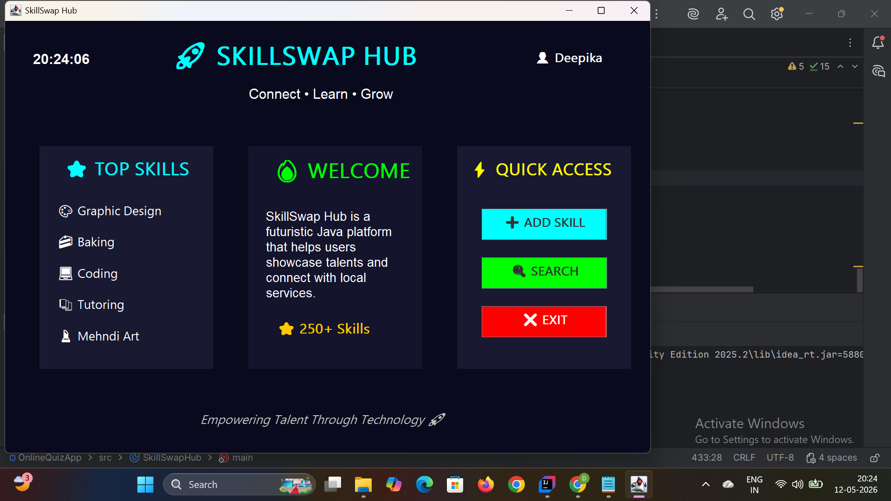

# 🚀 SkillSwap Hub

A Java Swing-based desktop application that helps users connect, share, and discover skills.

## 📸 Project Screenshot

## 💡 Features
- Add new skills
- Search trending skills
- Simple GUI dashboard
- Clock display
- Clean UI design

## 🎯 Purpose
This project is designed to connect learners and skilled people in a simple way using Java desktop UI.

## 🛠️ Tech Used
- Java
- Swing (GUI)

## ▶️ How to Run
